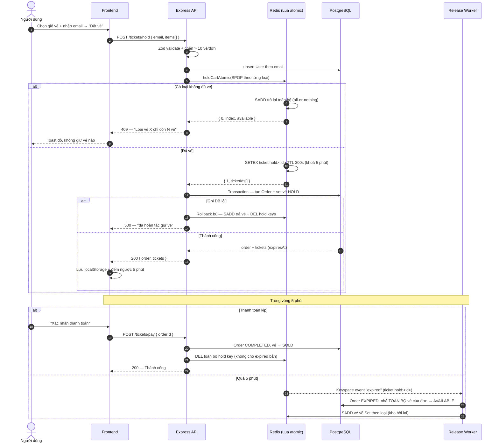
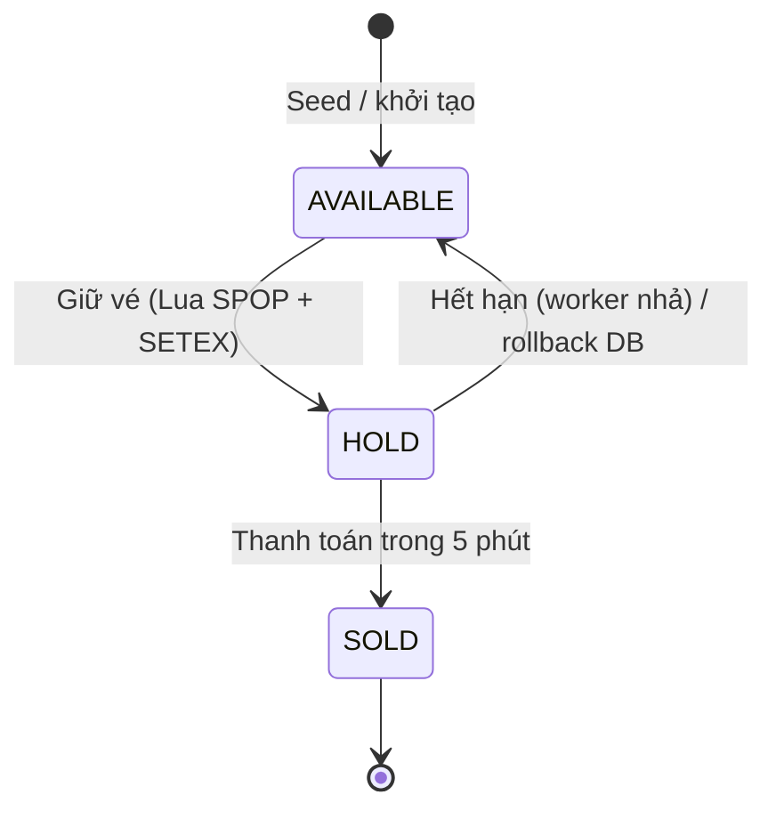

# 🎟️ Mini Ticketbox

> **Tác giả:** _Nguyễn Thanh Hòa_
>
> Bài test Fullstack — Xây dựng hệ thống bán vé giới hạn **500 vé** cho sự kiện có
> thể lên tới **~5.000 người dùng đồng thời** tranh vé, F5 liên tục. Trọng tâm:
> **chống bán quá số lượng (over-selling)** ở backend và **trải nghiệm mượt dưới
> tải cao** ở frontend.

---

## 1. Tổng quan bài toán

Khi cổng mở bán, hàng nghìn request đổ vào cùng một mili-giây để giành 500 vé.
Thách thức cốt lõi:

1. **Race condition / Over-selling** — hai người không bao giờ được giữ trùng một vé.
2. **Giữ vé 5 phút** rồi tự động nhả nếu không thanh toán — không dùng `setTimeout`.
3. **UX dưới tải cao** — chống spam click, đồng bộ đồng hồ đếm ngược, số vé real-time.

## 2. Tech Stack

| Lớp          | Công nghệ                                                                                                                |
| ------------ | ------------------------------------------------------------------------------------------------------------------------ |
| **Backend**  | Node.js, Express, TypeScript (strict), Prisma ORM, PostgreSQL, Redis (ioredis), Zod, Jest                                |
| **Frontend** | React 19, TanStack Start (SSR) + Router + Query, TailwindCSS v4, shadcn-style UI, lucide-react, Vitest + Testing Library |
| **Hạ tầng**  | Docker Compose (PostgreSQL 15 + Redis 7)                                                                                 |

## 3. Kiến trúc dự án

### 3.1. Chống Over-selling — Redis Lua Script (Atomic)

Trái tim của hệ thống. **Không** dùng logic “đọc rồi ghi” (`SELECT count → trừ → UPDATE`)
vì sẽ dính race condition. Thay vào đó:

- Mỗi **loại vé** có một Redis Set riêng: `tickets:available:<type>` chứa ID các vé còn trống.
- Việc trừ kho chạy trong **một Lua script atomic** (`holdCart.lua`). Redis đơn luồng
  ⇒ script chạy trọn vẹn, không request nào chen ngang:
  - `SPOP` lấy đúng số lượng vé cần cho từng loại. `SPOP` bảo đảm 2 request **không bao giờ**
    lấy trùng một ID.
  - Nếu **bất kỳ loại nào không đủ** ⇒ **rollback toàn bộ** (`SADD` trả lại các vé đã lấy)
    và trả về lỗi ⇒ giỏ hàng **all-or-nothing**, không giữ nửa vời.
  - Nếu đủ ⇒ đặt `SETEX ticket:hold:<id>` TTL 300s cho từng vé (khoá 5 phút) — cùng trong
    một lượt atomic với thao tác trừ kho.
- PostgreSQL là **nguồn chân lý bền vững**: sau khi RAM khoá thành công mới ghi Order + Ticket
  trong transaction. Nếu ghi DB lỗi ⇒ **hoàn tác bù (compensating)**: trả vé về Redis Set.

### 3.2. Tự động nhả vé sau 5 phút — Redis Keyspace Notifications

- Bật `notify-keyspace-events Ex` (thực hiện lúc khởi động, trong `setupRedisKeyspaceNotifications`).
- `ReleaseTicketWorker` subscribe kênh `__keyevent@0__:expired`. Khi hold key `ticket:hold:<id>`
  hết hạn, Redis bắn event ⇒ worker **hết hạn cả đơn** (giỏ vé) và **nhả toàn bộ vé của đơn đó**
  về đúng Set theo loại, dọn các hold key anh em.
- Cơ chế này thay cho `setTimeout` (không sống sót qua restart, không scale) → dựa vào Redis, tin cậy.

### 3.3. Real-time số vé còn lại — Server-Sent Events (SSE)

- `GET /tickets/stream` phát định kỳ 2s: `{ availableCount, byType }` (đếm `SCARD` từng Set — O(1)).
- Frontend `useTicketStream` tự **reconnect với exponential backoff** khi rớt kết nối / server 503.

### 3.4. Clean Code & chuẩn hoá

- **Response chuẩn** mọi endpoint: `{ success, data, error, message }`.
- **Global Error Handler** tập trung; service ném `AppError(message, statusCode)`; controller bọc `catchAsync`
  ⇒ không rải rác try/catch.
- **Validate tại cửa ngõ** bằng Zod cho toàn bộ body/params.
- Chỉ `SELECT` trường cần thiết; luôn dùng Prisma parameterized (chống SQL injection).

### 3.5. Sơ đồ luồng giữ vé



**Vòng đời trạng thái vé:**



## 4. Cấu trúc thư mục

```text
mini-ticketbox/
├── docker-compose.yaml        # 4 service: postgres, redis, backend, frontend
├── .env.example               # cấu hình dùng chung (copy → .env)
├── backend/
│   ├── Dockerfile             # build + entrypoint tự migrate & seed
│   ├── prisma/                # schema (multi-file), migrations, seed
│   └── src/
│       ├── api/               # routers + controllers
│       ├── core/              # errors (AppError), utils (catchAsync)
│       ├── database/          # prisma, redis (keys + sync + keyspace)
│       ├── dto/               # Zod schemas
│       └── services/          # nghiệp vụ + scripts/*.lua + workers/
└── frontend/
    └── src/
        ├── features/          # tickets, checkout, admin (api/hooks/ui)
        ├── components/        # UI dùng chung
        ├── routes/            # TanStack file-based routing
        └── lib/               # api-client, query-client, format…
```

## 5. Tính năng

- **Trang chủ**: hero sự kiện + số vé còn lại real-time (SSE).
- **Quầy đặt vé** (layout kiểu POS): danh sách loại vé bên trái, giỏ vé (cuống vé) bên phải.
  Mua **nhiều loại/nhiều số lượng cùng lúc** (tối đa 10 vé/đơn), **xác minh bằng email**.
- **Giữ vé & thanh toán**: đồng hồ đếm ngược 5 phút, khôi phục phiên khi F5, thanh toán giả lập.
- **Trang Admin**: thống kê vé (trống/đang giữ/đã bán), doanh thu, và **bóc tách theo từng loại vé**;
  tự làm mới mỗi 3s.

## 6. Chạy dự án với Docker

Yêu cầu duy nhất: **Docker** (kèm Docker Compose v2).

```bash
docker compose up --build
```

Lệnh này tự động dựng **toàn bộ**:

1. **PostgreSQL** + **Redis** (chờ tới khi `healthy`).
2. **Backend**: build image → **chạy migrations** → **seed 500 vé** (idempotent,
   bỏ qua nếu đã có dữ liệu) → khởi động API.
3. **Frontend**: build image → phục vụ giao diện.

Sau khi các container báo `healthy`, mở:

| Dịch vụ         | URL                          |
| --------------- | ---------------------------- |
| 🖥️ Frontend     | **http://localhost:3000**    |
| ⚙️ Backend API  | http://localhost:8080/api    |
| 🩺 Health check | http://localhost:8080/health |

Dừng: `docker compose down` · Xoá sạch cả dữ liệu (seed lại từ đầu): `docker compose down -v`.

### Biến môi trường (tuỳ chọn)

Compose đã có sẵn giá trị mặc định nên chạy được ngay. Muốn tuỳ chỉnh, **tạo một file
`.env` duy nhất ở thư mục gốc** (mẫu có sẵn ở `.env.example`):

```bash
cp .env.example .env
```

```env
# PostgreSQL
POSTGRES_USER=postgres
POSTGRES_PASSWORD=postgres
POSTGRES_DB=ticketbox
# Backend
NODE_ENV=production
JWT_SECRET=super-secret-change-me
# Frontend (URL trình duyệt gọi tới backend)
VITE_API_URL=http://localhost:8080/api
```

> Trong mạng Docker, backend tự nối tới `postgres:5432` và `redis:6379`
> (compose tự dựng `DATABASE_URL` / `REDIS_URL`), không cần cấu hình thêm.

### Chạy thủ công không dùng Docker (tuỳ chọn)

<details>
<summary>Bung để xem</summary>

```bash
# Hạ tầng
docker compose up -d postgres redis
# Backend (cổng 8080) — dùng DATABASE_URL/REDIS_URL trỏ localhost
cd backend && pnpm install && pnpm db:deploy && pnpm exec prisma db seed && pnpm dev
# Frontend (cổng 3000)
cd frontend && pnpm install && pnpm dev
```

</details>

## 7. API

| Method | Endpoint              | Mô tả                                                                |
| ------ | --------------------- | -------------------------------------------------------------------- |
| `GET`  | `/api/tickets/types`  | Danh sách loại vé (giá, tổng, số còn trống real-time)                |
| `POST` | `/api/tickets/hold`   | Giữ giỏ vé `{ email, items: [{ type, quantity }] }` (all-or-nothing) |
| `POST` | `/api/tickets/pay`    | Thanh toán giả lập `{ orderId }` → chuyển vé sang SOLD               |
| `GET`  | `/api/tickets/stream` | SSE số vé còn lại real-time (tổng + theo loại)                       |
| `GET`  | `/api/admin/stats`    | Thống kê vé, doanh thu, bóc tách theo loại                           |

## 8. Xử lý Edge Case (Frontend)

- **Chống spam click**: nút hành động dùng `useMutation` + `isPending` ⇒ disable + spinner ngay
  lần bấm đầu.
- **Đồng bộ đồng hồ**: `useCountdown` tính lại `expiresAt(server) − now` mỗi tick — **không** khởi tạo
  bằng `Date.now() + 5m` ⇒ không lệch khi chỉnh giờ máy / tab bị throttle.
- **Giữ phiên khi F5**: lưu hold vào `localStorage`; khi tải lại, nếu còn hạn ⇒ vào thẳng bước thanh toán
  (dùng layout effect để không “nháy” bước chọn vé). Hết hạn ⇒ dọn `localStorage`, hiện “Order Expired”.
- **Chịu lỗi**: bắt lỗi 400/409/503/mất mạng ⇒ toast đỏ với thông điệp rõ ràng; SSE tự reconnect.

## 9. Kiểm thử (Unit Test)

```bash
cd backend  && npm test        # Jest — logic giữ vé: thành công, all-or-nothing, rollback, giới hạn/đơn
cd frontend && npx vitest run  # Vitest — khôi phục phiên giữ vé sau F5 / đổi trang
```

## 10. Ghi chú kỹ thuật

- Hạn giữ vé: **300 giây**. Giới hạn: **10 vé/đơn**. Seed mặc định: **500 vé, 2 loại**
  (TIER S · ZONE A — 1.500.000đ; TIER A · ZONE B — 750.000đ).
- `docker-compose.yaml` dựng đủ **4 service**; backend có entrypoint tự chạy migrate + seed
  (idempotent) rồi mới khởi động — reviewer chỉ cần `docker compose up`.
- Keyspace notification được bật bằng code lúc khởi động backend nên **không cần** cấu hình thêm trên Redis.
- Backend khi khởi động luôn **đồng bộ lại các Set vé trống** từ DB lên Redis, nên restart là an toàn.
- Frontend chạy ở chế độ dev-server (Vite) trong container để phục vụ ổn định cả SSR lẫn client.

## 11. Cần cải thiện & Tính năng mở rộng

> Để có thể đưa hệ thống từ **bài test** lên **production-ready**, ta cần cải thiện và phát triển thêm các hạng mục sau:

### Bảo mật (Security) 🔒

| Hạng mục                  | Hiện trạng                                                                       | Đề xuất                                                                                            |
| ------------------------- | -------------------------------------------------------------------------------- | -------------------------------------------------------------------------------------------------- |
| **Xác thực & phân quyền** | Không có — ai cũng truy cập được `/api/admin/stats` và thanh toán bất kỳ đơn nào | Thêm JWT middleware; bảo vệ route admin; xác minh quyền sở hữu đơn hàng khi thanh toán             |
| **Rate Limiting**         | Không có — một user có thể spam `/api/tickets/hold` liên tục                     | Thêm `express-rate-limit` hoặc Redis-based rate limiter (sliding window) cho các endpoint nhạy cảm |
| **Security Headers**      | Không dùng `helmet()`                                                            | Thêm middleware Helmet để thiết lập X-Content-Type-Options, X-Frame-Options, CSP, v.v.             |
| **CORS**                  | Không cấu hình rõ ràng                                                           | Thêm `cors()` whitelist domain frontend cụ thể                                                     |
| **Idempotency Key**       | Không có — request retry (mất mạng) có thể tạo trùng đơn                         | Hỗ trợ header `Idempotency-Key` cho các endpoint mutating                                          |
| **Xác minh đơn hàng**     | `POST /pay` chỉ kiểm `orderId`, ai biết UUID đều thanh toán được                 | Liên kết đơn với user (email/token) và xác minh quyền sở hữu                                       |

### Khả năng mở rộng (Scalability) 📈

| Hạng mục                   | Hiện trạng                                                                                  | Đề xuất                                                                                               |
| -------------------------- | ------------------------------------------------------------------------------------------- | ----------------------------------------------------------------------------------------------------- |
| **Multi-instance**         | Redis Keyspace `SUBSCRIBE` chỉ 1 instance nhận event → chạy nhiều pod sẽ bị trùng/mất event | Dùng **BullMQ** (delayed job) thay cho keyspace notification, hoặc dùng Redis Stream + consumer group |
| **SSE backpressure**       | Mỗi client → 1 `SCARD`/2s. 5.000 client = 2.500 call/s chỉ để stream                        | Cache kết quả `SCARD` tập trung (1 interval broadcast), dùng pub/sub fan-out hoặc WebSocket room      |
| **Connection pooling**     | Redis client dùng cấu hình mặc định                                                         | Cấu hình `maxRetriesPerRequest`, `retryStrategy`, pool size cho ioredis                               |
| **Reconciliation job**     | Nếu worker bị ngắt kết nối lúc key expired → vé kẹt HOLD mãi mãi                            | Thêm cronjob quét `orders WHERE status='PENDING' AND expiresAt < NOW()` để dọn vé bị kẹt              |
| **Prisma connection pool** | Dùng cấu hình connection pool mặc định                                                      | Tuning `connection_limit` cho Prisma phù hợp với spike traffic 5.000 concurrent users                 |

### Hệ thống giám sát (Observability) 🔍

- **Structured Logging**: Thay `console.log` bằng **Pino** hoặc **Winston** — có log level, timestamp, request correlation ID.
- **Request Tracing**: Gắn `X-Request-Id` cho mỗi request, truyền xuyên suốt service → dễ debug trong production.
- **Metrics & Monitoring**: Thu thập Prometheus metrics (request duration, ticket hold/pay rate, error rate) + Grafana dashboard.
- **Health check nâng cao**: Endpoint `/health` hiện chỉ trả `{ status: "ok" }` — nên kiểm tra cả kết nối Redis và PostgreSQL (readiness probe).
- **Dead Letter Queue**: Log lại các thao tác thất bại (DB write sau Redis hold) vào DLQ để retry hoặc alert.

### Giao diện & Trải nghiệm người dùng (Frontend UX) 🎨

| Hạng mục                   | Đề xuất                                                                                                              |
| -------------------------- | -------------------------------------------------------------------------------------------------------------------- |
| **Responsive / Mobile**    | Layout POS hiện dùng `grid-cols-[1fr_420px]` — cần breakpoint cho tablet/mobile (stack dọc, bottom sheet cho giỏ vé) |
| **SEO & Meta tags**        | Tiêu đề vẫn là "TanStack Start Starter", thiếu meta description/OG tags                                              | Thêm `<title>`, `<meta description>`, Open Graph cho từng route; cập nhật `manifest.json` |
| **Empty / Sold-out State** | Không có màn hình "Hết vé" riêng — thiết kế trang sold-out chuyên biệt với CTA phù hợp                               |
| **Error Boundary**         | Không có React Error Boundary — crash component sẽ trắng toàn trang → bọc ErrorBoundary có fallback UI               |
| **Dark Mode toggle**       | CSS variables cho `.dark` đã sẵn sàng nhưng chưa có nút chuyển đổi                                                   | Thêm UI toggle dark/light trên Header                                                     |
| **Page Transitions**       | Chuyển trang tức thì, không animation — áp dụng View Transitions API hoặc Framer Motion                              |
| **Cảnh báo rời trang**     | User có thể navigate khỏi checkout không cảnh báo — thêm `beforeunload` + `useBlocker`                               |
| **Offline indicator**      | Không phát hiện mất mạng — thêm banner "Mất kết nối" khi offline                                                     |
| **Code splitting**         | Tất cả route load cùng lúc — dùng `lazy()` trên route definition để tách bundle                                      |
| **Multi-tab sync**         | Mở nhiều tab có thể gây xung đột (1 tab thanh toán, tab khác vẫn hiện bước giữ)                                      | Dùng `BroadcastChannel` hoặc `storage` event để đồng bộ state giữa các tab                |
| **Tách component lớn**     | `TicketCart` (394 dòng) quá lớn, khó bảo trì                                                                         | Tách thành `TicketTypeCard`, `CartSidebar`, `MobileBottomBar`                             |

### Accessibility (a11y) ♿

- **ARIA labels**: Thêm `aria-label` cho các nút tương tác, input, và các phần tử icon-only.
- **Keyboard navigation**: Đảm bảo toàn bộ luồng đặt vé có thể thao tác bằng bàn phím (Tab, Enter, Escape).
- **Focus management**: Quản lý focus khi mở/đóng dialog, chuyển bước trong checkout.
- **`aria-live` region**: Số vé real-time (SSE) cần `aria-live="polite"` để screen reader thông báo thay đổi.
- **Skip-to-content link**: Thêm link "Bỏ qua menu" cho người dùng screen reader.
- **Color contrast**: Kiểm tra WCAG AA cho gradient text, badge, và các phần tử nhỏ.

### Kiểm thử (Testing) 🧪

| Loại                | Hiện trạng                                    | Đề xuất                                                                                     |
| ------------------- | --------------------------------------------- | ------------------------------------------------------------------------------------------- |
| **Unit (Backend)**  | 4 test case cho logic giữ vé — ✅ tốt         | Bổ sung test cho `PaymentService`, `AdminService`, worker, Zod schema, controller           |
| **Unit (Frontend)** | 1 file test (`CheckoutFlow.test.tsx`, 3 case) | Thêm test cho `useCountdown`, `useTicketStream`, `TicketCart`, API client, format utilities |
| **Integration**     | Không có — tất cả mock Redis/Prisma           | Viết integration test chạy với real Redis + PostgreSQL (testcontainers)                     |
| **E2E**             | Không có                                      | Thêm Playwright/Cypress cho luồng đặt vé end-to-end (chọn → giữ → thanh toán → hết hạn)     |
| **Lua Script**      | Chỉ test gián tiếp qua service mock           | Test trực tiếp Lua script với Redis thật                                                    |

### Tính năng đề xuất 🚀

| Tính năng                  | Mô tả                                                                            | Độ ưu tiên    |
| -------------------------- | -------------------------------------------------------------------------------- | ------------- |
| **Huỷ đơn chủ động**       | User có thể tự huỷ đơn đang giữ (nhả vé ngay) thay vì chờ hết 5 phút             | 🔴 Cao        |
| **Tra cứu đơn hàng**       | Endpoint + UI tra cứu đơn theo email hoặc mã đơn — xem trạng thái, chi tiết vé   | 🔴 Cao        |
| **Email xác nhận**         | Gửi email xác nhận khi thanh toán thành công (Nodemailer/Resend)                 | 🔴 Cao        |
| **Vé điện tử (QR Code)**   | Sinh QR code hoặc PDF vé sau thanh toán — user có thể tải/in                     | 🟡 Trung bình |
| **Hàng chờ (Queue)**       | Khi vé hết, user vào waiting list — nếu có vé nhả sẽ thông báo                   | 🟡 Trung bình |
| **Quản lý sự kiện (CRUD)** | Admin tạo/sửa/xoá sự kiện, loại vé, giá — hiện hardcode trong seed               | 🟡 Trung bình |
| **Thanh toán thật**        | Tích hợp cổng thanh toán (Stripe, VNPay, MoMo) thay cho giả lập                  | 🟡 Trung bình |
| **Đa ngôn ngữ (i18n)**     | Hỗ trợ tiếng Anh bên cạnh tiếng Việt — dùng `react-intl` hoặc `next-intl`        | 🟢 Thấp       |
| **PWA**                    | Service Worker + Web App Manifest — cho phép "Add to Home Screen", cache offline | 🟢 Thấp       |
| **API Documentation**      | Tự sinh OpenAPI/Swagger từ Zod schema — developer-friendly                       | 🟢 Thấp       |
| **Sơ đồ chỗ ngồi**         | UI chọn ghế trên sơ đồ (seat map) thay vì chỉ chọn loại vé                       | 🟢 Thấp       |
| **Analytics dashboard**    | Biểu đồ doanh thu, tỷ lệ chuyển đổi, peak traffic — giúp BTC ra quyết định       | 🟢 Thấp       |

### 8. Chất lượng code (Code Quality) 🧹

- **Magic numbers → Config**: Các giá trị `300` (giây), `10` (vé tối đa), `2000` (SSE interval) nên đưa vào file config/constants.
- **TypeScript strict consistency**: Thống nhất dùng `interface` vs `type`, tránh inline type.
- **API versioning**: Thêm prefix `/api/v1/` để tương thích ngược khi nâng cấp.
- **Storybook**: Tài liệu hoá component UI bằng Storybook — tiện review và test visual.
- **Env validation**: Validate biến môi trường (`VITE_API_URL`, `DATABASE_URL`) lúc khởi động bằng Zod — fail fast nếu thiếu.
